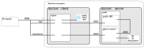

Elevation of Privilege
======================
[](https://github.com/tng/elevation-of-privilege/actions/workflows/checks.yml)

Threat Modeling via Serious Games is the easy way to get started and increase the security of your projects. This is a card game that developers, architects or security experts can play.

This application implements an online version of the card games [Elevation of Privilege](https://download.microsoft.com/download/F/A/E/FAE1434F-6D22-4581-9804-8B60C04354E4/EoP_Whitepaper.pdf) and [OWASP Cornucopia](https://owasp.org/www-project-cornucopia/), allowing to play the threat modeling games in remote or geo-distributed developer teams.


**Improve both: your application's security and your developer's awareness!**

<span class="d-none d-md-flex ml-2">
        
<get-repo class="" data-catalyst="">
    
    <details class="position-relative details-overlay details-reset js-codespaces-details-container hx_dropdown-fullscreen" data-action="
               toggle:get-repo#onDetailsToggle
               keydown:get-repo#onDetailsKeydown">
        <summary data-hydro-click="{&quot;event_type&quot;:&quot;repository.click&quot;,&quot;payload&quot;:{&quot;repository_id&quot;:404649362,&quot;target&quot;:&quot;CLONE_OR_DOWNLOAD_BUTTON&quot;,&quot;originating_url&quot;:&quot;https://github.com/tng/elevation-of-privilege/tree/buttontest&quot;,&quot;user_id&quot;:10673021}}" data-hydro-click-hmac="4929f67afb447b45a779c0197c0c6cc6f6fe3531c0a5593d0fd6523b45902e45" data-view-component="true" class="Button--primary Button--medium Button flex-1 d-inline-flex">    <span class="Button-content">
        <span class="Button-visual Button-leadingVisual">
          <svg aria-hidden="true" height="16" viewBox="0 0 16 16" version="1.1" width="16" data-view-component="true" class="octicon octicon-code">
    <path d="m11.28 3.22 4.25 4.25a.75.75 0 0 1 0 1.06l-4.25 4.25a.749.749 0 0 1-1.275-.326.749.749 0 0 1 .215-.734L13.94 8l-3.72-3.72a.749.749 0 0 1 .326-1.275.749.749 0 0 1 .734.215Zm-6.56 0a.751.751 0 0 1 1.042.018.751.751 0 0 1 .018 1.042L2.06 8l3.72 3.72a.749.749 0 0 1-.326 1.275.749.749 0 0 1-.734-.215L.47 8.53a.75.75 0 0 1 0-1.06Z"></path>
</svg>
        </span>
      <span class="Button-label">Code</span>
    </span>
      <span class="Button-visual Button-trailingAction">
        <svg aria-hidden="true" height="16" viewBox="0 0 16 16" version="1.1" width="16" data-view-component="true" class="octicon octicon-triangle-down">
    <path d="m4.427 7.427 3.396 3.396a.25.25 0 0 0 .354 0l3.396-3.396A.25.25 0 0 0 11.396 7H4.604a.25.25 0 0 0-.177.427Z"></path>
</svg>
      </span>
</summary>  
      <div class="position-relative">
        <div class="dropdown-menu dropdown-menu-sw p-0" style="top:6px;width:400px;max-width: calc(100vw - 320px);">
          <div data-target="get-repo.modal">
    <tab-container data-view-component="true">
  <div with_panel="true" data-view-component="true" class="tabnav hx_tabnav-in-dropdown color-bg-subtle m-0">
    
    <ul role="tablist" aria-label="Choose where to access your code" data-view-component="true" class="tabnav-tabs d-flex">
        <li role="presentation" data-view-component="true" class="hx_tabnav-in-dropdown-wrapper flex-1 d-inline-flex">
  <button data-tab="local" data-action="click:get-repo#localTabSelected focusin:get-repo#localTabSelected" id="local-tab" type="button" role="tab" aria-controls="local-panel" aria-selected="true" data-view-component="true" class="tabnav-tab flex-1" tabindex="0">
    
      <span data-view-component="true">Local</span>
    
</button></li>
        <li role="presentation" data-view-component="true" class="hx_tabnav-in-dropdown-wrapper flex-1 d-inline-flex">
  <button data-tab="cloud" data-action="click:get-repo#cloudTabSelected focusin:get-repo#cloudTabSelected" data-target="feature-callout.dismisser" id="cloud-tab" type="button" role="tab" aria-controls="cloud-panel" data-view-component="true" class="tabnav-tab flex-1" aria-selected="false" tabindex="-1">
    
      <span data-view-component="true">          <span>Codespaces</span>
</span>
    
</button></li>
</ul>    
</div>    <div id="local-panel" role="tabpanel" tabindex="0" aria-labelledby="local-tab" data-view-component="true">          <ul class="list-style-none">
              <li class="Box-row p-3">
  <a class="Link--muted float-right tooltipped tooltipped-s" href="https://docs.github.com/articles/which-remote-url-should-i-use" rel="noopener" target="_blank" aria-label="Which remote URL should I use?">
  <svg aria-hidden="true" height="16" viewBox="0 0 16 16" version="1.1" width="16" data-view-component="true" class="octicon octicon-question">
    <path d="M0 8a8 8 0 1 1 16 0A8 8 0 0 1 0 8Zm8-6.5a6.5 6.5 0 1 0 0 13 6.5 6.5 0 0 0 0-13ZM6.92 6.085h.001a.749.749 0 1 1-1.342-.67c.169-.339.436-.701.849-.977C6.845 4.16 7.369 4 8 4a2.756 2.756 0 0 1 1.637.525c.503.377.863.965.863 1.725 0 .448-.115.83-.329 1.15-.205.307-.47.513-.692.662-.109.072-.22.138-.313.195l-.006.004a6.24 6.24 0 0 0-.26.16.952.952 0 0 0-.276.245.75.75 0 0 1-1.248-.832c.184-.264.42-.489.692-.661.103-.067.207-.132.313-.195l.007-.004c.1-.061.182-.11.258-.161a.969.969 0 0 0 .277-.245C8.96 6.514 9 6.427 9 6.25a.612.612 0 0 0-.262-.525A1.27 1.27 0 0 0 8 5.5c-.369 0-.595.09-.74.187a1.01 1.01 0 0 0-.34.398ZM9 11a1 1 0 1 1-2 0 1 1 0 0 1 2 0Z"></path>
</svg>
</a>

<div class="text-bold">
  <svg aria-hidden="true" height="16" viewBox="0 0 16 16" version="1.1" width="16" data-view-component="true" class="octicon octicon-terminal mr-2">
    <path d="M0 2.75C0 1.784.784 1 1.75 1h12.5c.966 0 1.75.784 1.75 1.75v10.5A1.75 1.75 0 0 1 14.25 15H1.75A1.75 1.75 0 0 1 0 13.25Zm1.75-.25a.25.25 0 0 0-.25.25v10.5c0 .138.112.25.25.25h12.5a.25.25 0 0 0 .25-.25V2.75a.25.25 0 0 0-.25-.25ZM7.25 8a.749.749 0 0 1-.22.53l-2.25 2.25a.749.749 0 0 1-1.275-.326.749.749 0 0 1 .215-.734L5.44 8 3.72 6.28a.749.749 0 0 1 .326-1.275.749.749 0 0 1 .734.215l2.25 2.25c.141.14.22.331.22.53Zm1.5 1.5h3a.75.75 0 0 1 0 1.5h-3a.75.75 0 0 1 0-1.5Z"></path>
</svg>
  Clone
</div>

<tab-container>

  <div class="UnderlineNav my-2 box-shadow-none">
    <div class="UnderlineNav-body" role="tablist">
          <!-- '"` --><!-- </textarea></xmp> --><form data-remote="true" data-turbo="false" action="/users/set_protocol?protocol_type=push" accept-charset="UTF-8" method="post"><input type="hidden" name="authenticity_token" value="Kq2MlBdisWTmvaHa0PdLrGWzM-NLSVoE-d9OY4GbBOEBPsqHOFfipEiCuuw7o16gw-xi27lKmq2ktKzLghHG1g">
            <button name="protocol_selector" type="submit" role="tab" class="UnderlineNav-item" value="http" data-hydro-click="{&quot;event_type&quot;:&quot;clone_or_download.click&quot;,&quot;payload&quot;:{&quot;feature_clicked&quot;:&quot;USE_HTTPS&quot;,&quot;git_repository_type&quot;:&quot;REPOSITORY&quot;,&quot;repository_id&quot;:404649362,&quot;originating_url&quot;:&quot;https://github.com/tng/elevation-of-privilege/tree/buttontest&quot;,&quot;user_id&quot;:10673021}}" data-hydro-click-hmac="0e9ff79236e9730876b0a6580b95583659aa65e1888af3f81265227288102994" aria-selected="false" tabindex="-1">
              HTTPS
</button></form>          <!-- '"` --><!-- </textarea></xmp> --><form data-remote="true" data-turbo="false" action="/users/set_protocol?protocol_type=push" accept-charset="UTF-8" method="post"><input type="hidden" name="authenticity_token" value="Crfx7OB3YF-FqhVsmCu23dRrh-gDxX__TwDNew8-33chJLf_z0IznyuVDlpzf6PRcjTW0PHGv1YSay_TDLQdQA">
            <button name="protocol_selector" type="submit" role="tab" class="UnderlineNav-item" aria-selected="true" value="ssh" data-hydro-click="{&quot;event_type&quot;:&quot;clone_or_download.click&quot;,&quot;payload&quot;:{&quot;feature_clicked&quot;:&quot;USE_SSH&quot;,&quot;git_repository_type&quot;:&quot;REPOSITORY&quot;,&quot;repository_id&quot;:404649362,&quot;originating_url&quot;:&quot;https://github.com/tng/elevation-of-privilege/tree/buttontest&quot;,&quot;user_id&quot;:10673021}}" data-hydro-click-hmac="42f44e7d1a79c7d9347e5e5599a79960b67e6b9dcb2e59faf43f0afd0794ebd2" tabindex="0">
              SSH
</button></form>          <!-- '"` --><!-- </textarea></xmp> --><form data-remote="true" data-turbo="false" action="/users/set_protocol?protocol_type=push" accept-charset="UTF-8" method="post"><input type="hidden" name="authenticity_token" value="FWB83So07bfZTHmDywzLfqyU6-sU_cxaGF9lMdmtDpY-8zrOBQG-d3dzYrUgWN5yCsu60-b-DPNFNIeZ2ifMoQ">
            <button name="protocol_selector" type="submit" role="tab" class="UnderlineNav-item" value="gh_cli" data-hydro-click="{&quot;event_type&quot;:&quot;clone_or_download.click&quot;,&quot;payload&quot;:{&quot;feature_clicked&quot;:&quot;USE_GH_CLI&quot;,&quot;git_repository_type&quot;:&quot;REPOSITORY&quot;,&quot;repository_id&quot;:404649362,&quot;originating_url&quot;:&quot;https://github.com/tng/elevation-of-privilege/tree/buttontest&quot;,&quot;user_id&quot;:10673021}}" data-hydro-click-hmac="1f2e523e5c676224658c9d39003f157345996e3c6a61efe38c552d160e5ef216" aria-selected="false" tabindex="-1">
              GitHub CLI
</button></form>    </div>
  </div>

  <div role="tabpanel" hidden="">
    <div class="input-group">
  <input type="text" class="form-control input-monospace input-sm color-bg-subtle" data-autoselect="" value="https://github.com/TNG/elevation-of-privilege.git" aria-label="https://github.com/TNG/elevation-of-privilege.git" readonly="">
  <div class="input-group-button">
    <clipboard-copy value="https://github.com/TNG/elevation-of-privilege.git" aria-label="Copy to clipboard" class="btn btn-sm js-clipboard-copy tooltipped-no-delay ClipboardButton js-clone-url-http" data-copy-feedback="Copied!" data-tooltip-direction="n" data-hydro-click="{&quot;event_type&quot;:&quot;clone_or_download.click&quot;,&quot;payload&quot;:{&quot;feature_clicked&quot;:&quot;COPY_URL&quot;,&quot;git_repository_type&quot;:&quot;REPOSITORY&quot;,&quot;repository_id&quot;:404649362,&quot;originating_url&quot;:&quot;https://github.com/tng/elevation-of-privilege/tree/buttontest&quot;,&quot;user_id&quot;:10673021}}" data-hydro-click-hmac="0213ec3b6949c894e9ce26886bf727a5ed08ad1c439cfdf7f40052be7cfe74b4" tabindex="0" role="button"><svg aria-hidden="true" height="16" viewBox="0 0 16 16" version="1.1" width="16" data-view-component="true" class="octicon octicon-copy js-clipboard-copy-icon d-inline-block">
    <path d="M0 6.75C0 5.784.784 5 1.75 5h1.5a.75.75 0 0 1 0 1.5h-1.5a.25.25 0 0 0-.25.25v7.5c0 .138.112.25.25.25h7.5a.25.25 0 0 0 .25-.25v-1.5a.75.75 0 0 1 1.5 0v1.5A1.75 1.75 0 0 1 9.25 16h-7.5A1.75 1.75 0 0 1 0 14.25Z"></path><path d="M5 1.75C5 .784 5.784 0 6.75 0h7.5C15.216 0 16 .784 16 1.75v7.5A1.75 1.75 0 0 1 14.25 11h-7.5A1.75 1.75 0 0 1 5 9.25Zm1.75-.25a.25.25 0 0 0-.25.25v7.5c0 .138.112.25.25.25h7.5a.25.25 0 0 0 .25-.25v-7.5a.25.25 0 0 0-.25-.25Z"></path>
</svg><svg aria-hidden="true" height="16" viewBox="0 0 16 16" version="1.1" width="16" data-view-component="true" class="octicon octicon-check js-clipboard-check-icon color-fg-success d-inline-block d-sm-none">
    <path d="M13.78 4.22a.75.75 0 0 1 0 1.06l-7.25 7.25a.75.75 0 0 1-1.06 0L2.22 9.28a.751.751 0 0 1 .018-1.042.751.751 0 0 1 1.042-.018L6 10.94l6.72-6.72a.75.75 0 0 1 1.06 0Z"></path>
</svg></clipboard-copy>
  </div>
</div>

    <p class="mt-2 mb-0 f6 color-fg-muted">
        Use Git or checkout with SVN using the web URL.
    </p>
  </div>

  <div role="tabpanel">

    <div class="input-group">
  <input type="text" class="form-control input-monospace input-sm color-bg-subtle" data-autoselect="" value="git@github.com:TNG/elevation-of-privilege.git" aria-label="git@github.com:TNG/elevation-of-privilege.git" readonly="">
  <div class="input-group-button">
    <clipboard-copy value="git@github.com:TNG/elevation-of-privilege.git" aria-label="Copy to clipboard" class="btn btn-sm js-clipboard-copy tooltipped-no-delay ClipboardButton js-clone-url-ssh" data-copy-feedback="Copied!" data-tooltip-direction="n" data-hydro-click="{&quot;event_type&quot;:&quot;clone_or_download.click&quot;,&quot;payload&quot;:{&quot;feature_clicked&quot;:&quot;COPY_URL&quot;,&quot;git_repository_type&quot;:&quot;REPOSITORY&quot;,&quot;repository_id&quot;:404649362,&quot;originating_url&quot;:&quot;https://github.com/tng/elevation-of-privilege/tree/buttontest&quot;,&quot;user_id&quot;:10673021}}" data-hydro-click-hmac="0213ec3b6949c894e9ce26886bf727a5ed08ad1c439cfdf7f40052be7cfe74b4" tabindex="0" role="button"><svg aria-hidden="true" height="16" viewBox="0 0 16 16" version="1.1" width="16" data-view-component="true" class="octicon octicon-copy js-clipboard-copy-icon d-inline-block">
    <path d="M0 6.75C0 5.784.784 5 1.75 5h1.5a.75.75 0 0 1 0 1.5h-1.5a.25.25 0 0 0-.25.25v7.5c0 .138.112.25.25.25h7.5a.25.25 0 0 0 .25-.25v-1.5a.75.75 0 0 1 1.5 0v1.5A1.75 1.75 0 0 1 9.25 16h-7.5A1.75 1.75 0 0 1 0 14.25Z"></path><path d="M5 1.75C5 .784 5.784 0 6.75 0h7.5C15.216 0 16 .784 16 1.75v7.5A1.75 1.75 0 0 1 14.25 11h-7.5A1.75 1.75 0 0 1 5 9.25Zm1.75-.25a.25.25 0 0 0-.25.25v7.5c0 .138.112.25.25.25h7.5a.25.25 0 0 0 .25-.25v-7.5a.25.25 0 0 0-.25-.25Z"></path>
</svg><svg aria-hidden="true" height="16" viewBox="0 0 16 16" version="1.1" width="16" data-view-component="true" class="octicon octicon-check js-clipboard-check-icon color-fg-success d-inline-block d-sm-none">
    <path d="M13.78 4.22a.75.75 0 0 1 0 1.06l-7.25 7.25a.75.75 0 0 1-1.06 0L2.22 9.28a.751.751 0 0 1 .018-1.042.751.751 0 0 1 1.042-.018L6 10.94l6.72-6.72a.75.75 0 0 1 1.06 0Z"></path>
</svg></clipboard-copy>
  </div>
</div>

    <p class="mt-2 mb-0 f6 color-fg-muted">
        Use a password-protected SSH key.
    </p>
  </div>

  <div role="tabpanel" hidden="">
    <div class="input-group">
  <input type="text" class="form-control input-monospace input-sm color-bg-subtle" data-autoselect="" value="gh repo clone TNG/elevation-of-privilege" aria-label="gh repo clone TNG/elevation-of-privilege" readonly="">
  <div class="input-group-button">
    <clipboard-copy value="gh repo clone TNG/elevation-of-privilege" aria-label="Copy to clipboard" class="btn btn-sm js-clipboard-copy tooltipped-no-delay ClipboardButton js-clone-url-gh-cli" data-copy-feedback="Copied!" data-tooltip-direction="n" data-hydro-click="{&quot;event_type&quot;:&quot;clone_or_download.click&quot;,&quot;payload&quot;:{&quot;feature_clicked&quot;:&quot;COPY_URL&quot;,&quot;git_repository_type&quot;:&quot;REPOSITORY&quot;,&quot;repository_id&quot;:404649362,&quot;originating_url&quot;:&quot;https://github.com/tng/elevation-of-privilege/tree/buttontest&quot;,&quot;user_id&quot;:10673021}}" data-hydro-click-hmac="0213ec3b6949c894e9ce26886bf727a5ed08ad1c439cfdf7f40052be7cfe74b4" tabindex="0" role="button"><svg aria-hidden="true" height="16" viewBox="0 0 16 16" version="1.1" width="16" data-view-component="true" class="octicon octicon-copy js-clipboard-copy-icon d-inline-block">
    <path d="M0 6.75C0 5.784.784 5 1.75 5h1.5a.75.75 0 0 1 0 1.5h-1.5a.25.25 0 0 0-.25.25v7.5c0 .138.112.25.25.25h7.5a.25.25 0 0 0 .25-.25v-1.5a.75.75 0 0 1 1.5 0v1.5A1.75 1.75 0 0 1 9.25 16h-7.5A1.75 1.75 0 0 1 0 14.25Z"></path><path d="M5 1.75C5 .784 5.784 0 6.75 0h7.5C15.216 0 16 .784 16 1.75v7.5A1.75 1.75 0 0 1 14.25 11h-7.5A1.75 1.75 0 0 1 5 9.25Zm1.75-.25a.25.25 0 0 0-.25.25v7.5c0 .138.112.25.25.25h7.5a.25.25 0 0 0 .25-.25v-7.5a.25.25 0 0 0-.25-.25Z"></path>
</svg><svg aria-hidden="true" height="16" viewBox="0 0 16 16" version="1.1" width="16" data-view-component="true" class="octicon octicon-check js-clipboard-check-icon color-fg-success d-inline-block d-sm-none">
    <path d="M13.78 4.22a.75.75 0 0 1 0 1.06l-7.25 7.25a.75.75 0 0 1-1.06 0L2.22 9.28a.751.751 0 0 1 .018-1.042.751.751 0 0 1 1.042-.018L6 10.94l6.72-6.72a.75.75 0 0 1 1.06 0Z"></path>
</svg></clipboard-copy>
  </div>
</div>

    <p class="mt-2 mb-0 f6 color-fg-muted">
      Work fast with our official CLI.
      <a class="Link--inTextBlock" href="https://cli.github.com" target="_blank">Learn more about the CLI</a>.
    </p>
  </div>
</tab-container>

</li>

<li class="Box-row Box-row--hover-gray p-3 mt-0">
  <a class="d-flex flex-items-center color-fg-default text-bold no-underline" rel="nofollow" data-hydro-click="{&quot;event_type&quot;:&quot;clone_or_download.click&quot;,&quot;payload&quot;:{&quot;feature_clicked&quot;:&quot;DOWNLOAD_ZIP&quot;,&quot;git_repository_type&quot;:&quot;REPOSITORY&quot;,&quot;repository_id&quot;:404649362,&quot;originating_url&quot;:&quot;https://github.com/tng/elevation-of-privilege/tree/buttontest&quot;,&quot;user_id&quot;:10673021}}" data-hydro-click-hmac="d5b01d80407db12a75fc4cb4b9d93e0f8eedddfbbf68762dbaddfe7821c48c6c" data-ga-click="Repository, download zip, location:repo overview" data-open-app="link" data-turbo="false" href="/TNG/elevation-of-privilege/archive/refs/heads/buttontest.zip">
    <svg aria-hidden="true" height="16" viewBox="0 0 16 16" version="1.1" width="16" data-view-component="true" class="octicon octicon-file-zip mr-2">
    <path d="M3.5 1.75v11.5c0 .09.048.173.126.217a.75.75 0 0 1-.752 1.298A1.748 1.748 0 0 1 2 13.25V1.75C2 .784 2.784 0 3.75 0h5.586c.464 0 .909.185 1.237.513l2.914 2.914c.329.328.513.773.513 1.237v8.586A1.75 1.75 0 0 1 12.25 15h-.5a.75.75 0 0 1 0-1.5h.5a.25.25 0 0 0 .25-.25V4.664a.25.25 0 0 0-.073-.177L9.513 1.573a.25.25 0 0 0-.177-.073H7.25a.75.75 0 0 1 0 1.5h-.5a.75.75 0 0 1 0-1.5h-3a.25.25 0 0 0-.25.25Zm3.75 8.75h.5c.966 0 1.75.784 1.75 1.75v3a.75.75 0 0 1-.75.75h-2.5a.75.75 0 0 1-.75-.75v-3c0-.966.784-1.75 1.75-1.75ZM6 5.25a.75.75 0 0 1 .75-.75h.5a.75.75 0 0 1 0 1.5h-.5A.75.75 0 0 1 6 5.25Zm.75 2.25h.5a.75.75 0 0 1 0 1.5h-.5a.75.75 0 0 1 0-1.5ZM8 6.75A.75.75 0 0 1 8.75 6h.5a.75.75 0 0 1 0 1.5h-.5A.75.75 0 0 1 8 6.75ZM8.75 3h.5a.75.75 0 0 1 0 1.5h-.5a.75.75 0 0 1 0-1.5ZM8 9.75A.75.75 0 0 1 8.75 9h.5a.75.75 0 0 1 0 1.5h-.5A.75.75 0 0 1 8 9.75Zm-1 2.5v2.25h1v-2.25a.25.25 0 0 0-.25-.25h-.5a.25.25 0 0 0-.25.25Z"></path>
</svg>
    Download ZIP
</a></li>

          </ul>
</div>
    <div id="cloud-panel" role="tabpanel" tabindex="0" hidden="hidden" aria-labelledby="cloud-tab" data-view-component="true" class="cloud-panel">              <div class="js-socket-channel js-updatable-content" data-channel="eyJjIjoicmVwb3NpdG9yeV9jb2Rlc3BhY2VzOjQwNDY0OTM2MjoxMDY3MzAyMSIsInQiOjE2OTIzNjY5ODF9--93b4e8f4299f6a5dfe01d284e612378308445e5106a1b22da4d5b13b2bbcb01d" data-url="/TNG/elevation-of-privilege/codespaces/code_menu_contents?name=buttontest" data-gid="MDEwOlJlcG9zaXRvcnk0MDQ2NDkzNjI=">
  <ul class="list-style-none">
    <li class="Box-row p-0 mt-0">
      <include-fragment id="lazyLoadedCodespacesList" data-target="get-repo.codespaceList" data-src="/codespaces?codespace%5Bref%5D=buttontest&amp;current_branch=buttontest&amp;event_target=REPO_PAGE&amp;repo=404649362" data-action="include-fragment-replace:get-repo#hideSpinner">
        <div class="d-flex flex-items-center" data-target="get-repo.codespaceLoadingMenu">
          <svg style="box-sizing: content-box; color: var(--color-icon-primary);" width="32" height="32" viewBox="0 0 16 16" fill="none" data-view-component="true" class="my-3 flex-1 anim-rotate">
  <circle cx="8" cy="8" r="7" stroke="currentColor" stroke-opacity="0.25" stroke-width="2" vector-effect="non-scaling-stroke"></circle>
  <path d="M15 8a7.002 7.002 0 00-7-7" stroke="currentColor" stroke-width="2" stroke-linecap="round" vector-effect="non-scaling-stroke"></path>
</svg>
        </div>
      </include-fragment>
    </li>
  </ul>
</div>

</div>
</tab-container></div>


<div class="p-3" data-targets="get-repo.platforms" data-platform="mac" hidden="">
  <h4 class="lh-condensed mb-3">Launching GitHub Desktop<span class="AnimatedEllipsis"></span></h4>
  <p class="color-fg-muted">
    If nothing happens, <a class="Link--inTextBlock" href="https://desktop.github.com/">download GitHub Desktop</a> and try again.
  </p>
    <button data-action="click:get-repo#onDetailsToggle" type="button" data-view-component="true" class="btn-link">
</button>
</div>
<div class="p-3" data-targets="get-repo.platforms" data-platform="windows" hidden="">
  <h4 class="lh-condensed mb-3">Launching GitHub Desktop<span class="AnimatedEllipsis"></span></h4>
  <p class="color-fg-muted">
    If nothing happens, <a class="Link--inTextBlock" href="https://desktop.github.com/">download GitHub Desktop</a> and try again.
  </p>
    <button data-action="click:get-repo#onDetailsToggle" type="button" data-view-component="true" class="btn-link">
</button>
</div>
<div class="p-3" data-targets="get-repo.platforms" data-platform="xcode" hidden="">
  <h4 class="lh-condensed mb-3">Launching Xcode<span class="AnimatedEllipsis"></span></h4>
  <p class="color-fg-muted">
    If nothing happens, <a class="Link--inTextBlock" href="https://developer.apple.com/xcode/">download Xcode</a> and try again.
  </p>
    <button data-action="click:get-repo#onDetailsToggle" type="button" data-view-component="true" class="btn-link">
</button>
</div>
<div class="p-3 " data-targets="get-repo.platforms" data-target="new-codespace.loadingVscode create-button.loadingVscode" data-platform="vscode" hidden="">
  <poll-include-fragment data-target="get-repo.vscodePoller new-codespace.vscodePoller create-button.vscodePoller" data-catalyst="">
    <h4 class="lh-condensed mb-3">Launching Visual Studio Code<span class="AnimatedEllipsis" data-hide-on-error=""></span></h4>
    <p class="color-fg-muted" data-hide-on-error="">Your codespace will open once ready.</p>
    <p class="color-fg-muted" data-show-on-error="" hidden="">There was a problem preparing your codespace, please try again.</p>
  </poll-include-fragment>
</div>


        </div>
      </div>
    </details>


</get-repo>

    </span>

### Why Threat Modeling?

Nowadays, security is a topic that concerns every IT project. What if a malicious actor (for financial, ideological or any other reasons) wants to corrupt the system you are building? What if some skilled person wants to break in and steal your intellectual property or the data you are holding?

Threat Modeling is a systematic approach to the question "[What can go wrong?](https://www.threatmodelingmanifesto.org/)". It helps you and your team to take an attacker's perspective and understand your system aside from its features and business value. You will collect threats to your system and mitigate their risk before they get exploited and harm your business.  

### And why Serious Games?

The idea to perform threat modeling on a system using a serious card game as developed by the security department at Microsoft. At its core, threat modeling should be done continuously as part of the (agile) development process. Thus, it should also be done by the developers, as they are the real experts on the system.  

Microsoft's game allows developers, architects and security experts to find threats to the system even if they do not have a strong background in IT security. It is a threat catalog that guides the player's thoughts to new and unusual perspectives on the system, just as an attacker would do. Gamification makes this a fun thing to do and keeps the players motivated to find creative attacks.

But most important the game will teach the developers to look at the system with security in their mind. Therefore, it raises the awareness for security during implementation, avoiding threats from the start.

### How is this done?

In [Elevation of Privilege](https://download.microsoft.com/download/F/A/E/FAE1434F-6D22-4581-9804-8B60C04354E4/EoP_Whitepaper.pdf), the game invented by Microsoft, each card represents a particular attack on the system. The cards are meant as a starting point for brainstorming and discussions, if and where such an attack can be used on the system. During its flow the game guides the players through these threats in a structured manner. As a result a list of possible security weaknesses is generated.

## Card decks

Currently, three game modes are supported, reflecting different aspects of modern software development projects:

### Elevation of Privilege

This is the classic [Elevation of Privilege](https://shostack.org/games/elevation-of-privilege) game, developed by [Adam Shostack](https://github.com/adamshostack).


### OWASP Cornucopia

Inspired by this, the game [Cornucopia](https://owasp.org/www-project-cornucopia/) has been developed by the [Open Web Application Security Project](https://owasp.org/) (OWASP). It specifically targets threat modeling of web application and might be an easy starting point for beginning threat modeling.


### Cumulus

[Cumulus](https://github.com/TNG/cumulus), developed at [TNG Technology Consulting](https://www.tngtech.com/en/index.html), is a threat modeling game targeting cloud and DevOps setups.


## For users

Currently, the game supports both card decks: 
    
* *Elevation of Privilege* and 
* *Cornucopia*,

more are to come. When uploading an architectural model of your system you can choose between different formats:

* an image (`.jpg`, `.png`, ...)
* JSON model generated with [OWASP Threat Dragon](https://owasp.org/www-project-threat-dragon/)
* no upload (this might be relevant you must comply to strict confidentiality regulation and want to supply the model via some different channel)

When starting the game you can configure the game mode and generate unique links for each of your players. With these links the players with their own hand of cards.

This game is intended to be supplemented by your favorite conferencing system. A crucial part are discussions between the players, so you better make sure your players can talk easily (e.g. via a video call).

Often it is beneficial (but not necessary!) to have a moderator, experienced in the game, who can steer the discussions and cut them off in case they run too long. For this role, a spectator mode is available in the game.

For the case of Elevation of Privilege, we partly support the latest version (as of April 2022) of the [EoP card deck](https://github.com/adamshostack/eop). However, we deviate in some Denial-of-Service cards. In particular, we still use the cards of an older version of the EoP card deck ([pre April 2020](https://github.com/adamshostack/eop/commit/a967aa273bfce60aa5eb4d7f2a37b6ae312ffd01)) for the cards `DoS3`, `DoS4` and `DoS5`. We do this because find the older versions better suited for our use cases.

## For developers

This repository allows you to build docker containers ready to be deployed e.g. to Kubernetes.

Frontend and backend are written in Javascript, although there are plans to migrate to Typescript. This game uses [boardgame.io](https://boardgame.io/) as a framework for turn based games. The backend furthermore exposes an API using [koa](https://koajs.com/). Frontend is written in [react](https://reactjs.org/).

### Running the app
There are two components that need to be started in order to run the game.
1. Server
2. UI/Client

#### Docker
To start a dockerized version of the game use

```bash
docker-compose up --build
```

This will start the app on port `8080` and make it accessible at [http://localhost:8080/](http://localhost:8080/).
The docker-compose setup starts two containers: 

* `threats-client`: running `nginx` as a reverse proxy and serving the react application
* `threats-server`: running the `nodejs` backends: public API and game server



#### Local deployment

The server can be started using:

```bash
npm run server
```

This will also automatically build the server first, compiling any TypeScript code, and then start the backend
application listening on the following ports:

| Application | Description                                                       | Environment Variable | Default |
|-------------|-------------------------------------------------------------------|----------------------|---------|
| Server      | The game server for boardgame, exposes socket.io endpoints        | `SERVER_PORT`        | 8000    |
| Lobby API   | Internal API for lobby operations, should not be exposed publicly | `INTERNAL_API_PORT`  | 8002    |
| Public API  | Public API to create games and retrieve game info                 | `API_PORT`           | 8001    |

 If you want to build the server code manually, you can do so by running

```bash
npm run build:server
```

The UI can be started using

```bash
npm start
```

which starts a watch mode that automatically compiles and reloads the UI every time source files are changed. The UI is
accessible at [http://localhost:3000/](http://localhost:3000/).

You can also build the client manually by running

```bash
npm run build:client
```

The UI can also be built and served statically (see the [dockerfile](docker/client.dockerfile)), keep in mind that the values of the port numbers will be hard coded in the generated files.

To build both the client and the server, just run

```bash
npm run build
```

#### Imprint and privacy notices

Links to imprint and privacy notices can be included into the client, if the environment variables

```bash
export REACT_APP_EOP_IMPRINT="https://example.tld/imprint/"
export REACT_APP_EOP_PRIVACY="https://example.tld/privacy/"
```

are set when building the app.
When building the client via docker these env vars can be set by defining `build-args`

```bash
docker build --build-arg "REACT_APP_EOP_IMPRINT=https://example.tld/imprint/" --build-arg "REACT_APP_EOP_PRIVACY=https://example.tld/privacy/" -f docker/client.dockerfile . -t "some-tag"
```

### Using MongoDB

As of boardgame.io v0.39.0, MongoDB is no longer supported as a database connector. There is currently no external library providing this functionality, however there is an [implementation](https://github.com/boardgameio/boardgame.io/issues/6#issuecomment-656144940) posted on github. This class implements the abstract functions in [this base class](https://github.com/boardgameio/boardgame.io/blob/ce8ef4a16bcc420b05c5e0751b41f168352bce7d/src/server/db/base.ts#L49-L111).

MongoDB has also been removed as a dependency so must be installed by running

```bash
npm install mongodb
```

An equivalent to `ModelFlatFile` should also be implemented. This extends the FlatFile database connector to allow the model to be saved to the database. The functions this implements are `setModel`, which allows the model to be set, and `fetch`, which is also overwritten to allow the model to be read in addition to the other properties. The implementations of these for the FlatFile object are available in `ModelFlatFile.ts`

Once the database connector is fully implemented, it can be used instead of a FlatFile by changing the object used in `config.ts`. Just replace `ModelFlatFile` with the name of the mongoDB database connector.

## TODO

### Migrate to Typescript

Work on migrating to TypeScript has already started but is not complete yet. Most of the server code and the code shared
between client snd server has already been migrated but a lot of the client is still missing.

In order to migrate a
component of the client to TypeScript, follow this pattern:

* Change the file extension of the file to `tsx`
* Create an interface for specifying the props of the component
* Use that interface when declaring the component
* Go through the rest of the file and fix any TypeScript or linter errors / warnings
* Change the extension of any accompanying test files to `tsx`
* Fix any potential errors in there

Among the files `src/client/pages/*.tsx` you will find different examples for how to set up TypeScript components.
### Other TODOs

* UI fixes (optimizations, smaller screens)
* Optimize the card sprite sheet (can look at SVGs)
* Improve test coverage, write tests for possible game states and moves
* Refactor and have reusable components
* Optimize component renders through `shouldComponentUpdate`
* Write contributing guide

## Credits
The card game Elevation of Privilege was originally invented by [Adam Shostack](https://adam.shostack.org/) at Microsoft and is licensed under [CC BY 3.0](https://creativecommons.org/licenses/by/3.0/). The [EoP Whitepaper](http://download.microsoft.com/download/F/A/E/FAE1434F-6D22-4581-9804-8B60C04354E4/EoP_Whitepaper.pdf) written by Adam can be downloaded which describes the motivation, experience and lessons learned in creating the game.

The card game Cornucopia was originally developed by the [OWASP Foundation](https://owasp.org/). In this application a slightly modified version of the original card game is used. This can be found in the subfolder `cornucopiaCards/`. As the original, the modified version is licensed under [CC BY-SA 3.0](https://creativecommons.org/licenses/by-sa/3.0/). 

The motivation for creating this online version of the game at Careem was due to a large number of teams working remotely across several geographies and we wanted to scale our method of teaching threat modeling to our engineering teams.

The game is built using [boardgame.io](https://boardgame.io/), a framework for developing turn based games. The graphics, icons and card images used in this version were extracted from the original card game built by Microsoft.

Made with :green_heart: at Careem and [TNG Technology Consulting](https://www.tngtech.com/en/)
